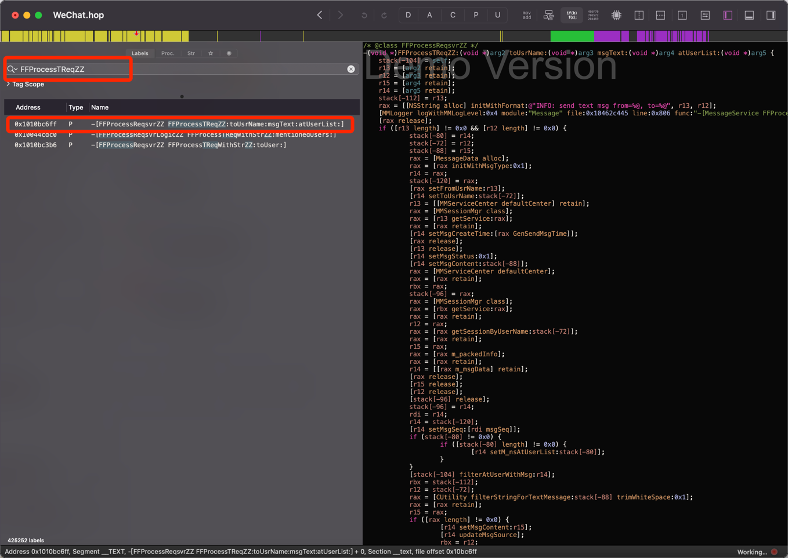
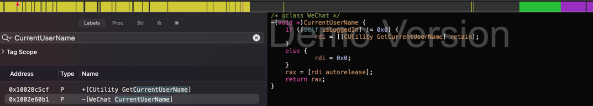

# Mac下的微信Hook
frida-tools
```
pip3 install install frida-tools
```
class-dump
```
cp ./tools/class-dump /usr/local/bin/
chmod 777 /usr/local/bin/class-dump
```
class-dump拿到微信的头文件
```
cd h
class-dump -H /Applications/WeChat.app
```
分析
```
grep toUser h/*
# 发现发送消息的在 FFProcessReqsvrZZ.h 这个头文件当中
h/FFProcessReqsvrZZ.h:- (id)forwardAppImageMessage:(id)arg1 toUser:(id)arg2 errMsg:(id *)arg3;
h/FFProcessReqsvrZZ.h:- (id)forwardVideoMessage:(id)arg1 toUser:(id)arg2 errMsg:(id *)arg3;
h/FFProcessReqsvrZZ.h:- (id)forwardMessage:(id)arg1 withReaderWrap:(id)arg2 toUser:(id)arg3;
h/FFProcessReqsvrZZ.h:- (id)forwardMessage:(id)arg1 toUser:(id)arg2 errMsg:(id *)arg3;
h/FFProcessReqsvrZZ.h:- (id)forwardAppEmojiMessage:(id)arg1 toUser:(id)arg2 errMsg:(id *)arg3;
h/FFProcessReqsvrZZ.h:- (id)forwardAppFileMessage:(id)arg1 toUser:(id)arg2 errMsg:(id *)arg3;
h/FFProcessReqsvrZZ.h:- (id)forwardEmojiMessage:(id)arg1 toUser:(id)arg2 errMsg:(id *)arg3;
h/FFProcessReqsvrZZ.h:- (id)forwardImageMessage:(id)arg1 toUser:(id)arg2 errMsg:(id *)arg3;
h/FFProcessReqsvrZZ.h:- (id)forwardTransferTextMessage:(id)arg1 toUser:(id)arg2 errMsg:(id *)arg3;
h/FFProcessReqsvrZZ.h:- (id)forwardTextMessage:(id)arg1 toUser:(id)arg2 errMsg:(id *)arg3;
h/FFProcessReqsvrZZ.h:- (id)resendAppReferMessage:(id)arg1 toUser:(id)arg2;
h/FFProcessReqsvrZZ.h:- (void)resendMsg:(id)arg1 toUser:(id)arg2;
h/FFProcessReqsvrZZ.h:- (id)SendGifAppMsgFromUsr:(id)arg1 toUser:(id)arg2 gifFilePath:(id)arg3;
h/FFProcessReqsvrZZ.h:- (id)SendGifFileMsgFromUsr:(id)arg1 toUser:(id)arg2 gifFileName:(id)arg3 gifFilePath:(id)arg4;
h/FFProcessReqsvrZZ.h:- (id)SendLocationMsgFromUser:(id)arg1 toUser:(id)arg2 withLatitude:(double)arg3 longitude:(double)arg4 poiName:(id)arg5 label:(id)arg6;
h/FFProcessReqsvrZZ.h:- (id)SendNamecardMsgFromUser:(id)arg1 toUser:(id)arg2 containingContact:(id)arg3;
h/FFProcessReqsvrZZ.h:- (BOOL)FFProcessTReqWithStrZZ:(id)arg1 toUser:(id)arg2;
```
得出，发送消息的方法是这个
```
- (id)FFProcessTReqZZ:(id)arg1 toUsrName:(id)arg2 msgText:(id)arg3 atUserList:(id)arg4;
```
hook验证
```shell
frida-trace -m "-[FFProcessReqsvrZZ forwardImageMessage*]" 微信
```
测试
```shell
lake-Pro:wechat-fradi lake$ frida-trace -m "-[FFProcessReqsvrZZ FFProcessTReqZZ*]" 微信
Instrumenting...                                                        
-[FFProcessReqsvrZZ FFProcessTReqZZ:toUsrName:msgText:atUserList:]: Loaded handler at "/Users/lake/dounine/github/wechat-fradi/__handlers__/FFProcessReqsvrZZ/FFProcessTReqZZ_toUsrName_msgTex_ed8287e4.js"
Started tracing 1 function. Press Ctrl+C to stop.                       
           /* TID 0x103 */
118390 ms  -[FFProcessReqsvrZZ FFProcessTReqZZ:0x600001ea8cc0 toUsrName:0x600001ea8cc0 msgText:0x60000433abb0 atUserList:0x60000433a730]
```
接下来我们就可以修改hook js文件对消息进去解码
```shell
cat __handlers__/FFProcessReqsvrZZ/FFProcessTReqZZ_toUsrName_msgTex_ed8287e4.js

onEnter(log, args, state) {
    log(`-[FFProcessReqsvrZZ FFProcessTReqZZ:${args[2]} toUsrName:${args[3]} msgText:${args[4]} atUserList:${args[5]}]`);
    log(`-[FFProcessReqsvrZZ FFProcessTReqZZ:${new ObjC.Object(args[2])} toUsrName:${new ObjC.Object(args[3])} msgText:${new ObjC.Object(args[4])} atUserList:${new ObjC.Object(args[5])}]`);
},
```
重新运行`frida-trace -m "-[FFProcessReqsvrZZ FFProcessTReqZZ*]" 微信`并发送Hi消息给自己或别人
```shell
  5800 ms  -[FFProcessReqsvrZZ FFProcessTReqZZ:0x600001ea8cc0 toUsrName:0x600001ea8cc0 msgText:0x600005f89e30 atUserList:0x600005f889c0]
  5800 ms  -[FFProcessReqsvrZZ FFProcessTReqZZ:wxid_3328123281112 toUsrName:wxid_3328123281112 msgText:hi atUserList:]
```
我们直接用代码修改消息内容
```shell
args[4] = ObjC.classes.NSString.stringWithString_("交流微信：wx-43210")
```
发送任何消息，都是发`交流微信：wx-43210`

接下来分析一下如何主动发送消息
应用程序->微信->显示包内容->Contents->MacOS->WeChat 拖进hopper然后默认选项即可

FFProcessReqsvrZZ方法被FFProcessReqsvrLogicZZ调用分析
```
/* @class FFProcessReqsvrLogicZZ */
-(unsigned char)FFProcessTReqWithStrZZ:(void *)arg2 mentionedUsers:(void *)arg3 {
    r12 = self;
    r13 = [arg2 retain];
    stack[-72] = [arg3 retain];
    if ([r13 length] != 0x0) {
            stack[-64] = r13;
            rax = [r13 lengthOfBytesUsingEncoding:0x4];
            rbx = rax;
            if (rax >= 0x4001) {
                    rax = [[NSString alloc] initWithFormat:@"ERROR: Text too long, length: %lu, utf8 length: %lu", [r13 length], rbx];
                    stack[0] = "-[MMMessageSendLogic FFProcessTReqWithStrZZ:mentionedUsers:]";
                    [MMLogger logWithMMLogLevel:0x2 module:"ComposeInputView" file:0x10458ec5a line:0x107 func:stack[0] message:rax];
                    [rax release];
                    rax = [NSBundle mainBundle];
                    rax = [rax retain];
                    r14 = rax;
                    r13 = [[rax localizedStringForKey:@"Message.Input.Too.Long.Title" value:@"" table:0x0] retain];
                    objc_unsafeClaimAutoreleasedReturnValue([NSAlert showAlertSheetWithTitle:r13 message:[[[[NSBundle mainBundle] retain] localizedStringForKey:@"Message.Input.Too.Long.Content" value:@"" table:0x0] retain] completion:0x0]);
                    [rax release];
                    [rax release];
                    [r13 release];
                    r15 = 0x0;
            }
            else {
                    rax = [WeChat sharedInstance];
                    rax = [rax retain];
                    r14 = [[rax CurrentUserName] retain];
                    [rax release];
                    rax = [r12 currnetChatContact];
                    rax = [rax retain];
                    r13 = [[rax m_nsUsrName] retain];
                    [rax release];
                    r12 = [[MMServiceCenter defaultCenter] retain];
                    objc_unsafeClaimAutoreleasedReturnValue([[[r12 getService:[FFProcessReqsvrZZ class]] retain] FFProcessTReqZZ:r14 toUsrName:r13 msgText:stack[-64] atUserList:stack[-72]]);
                    [rax release];
                    [r12 release];
                    [r13 release];
                    r15 = 0x1;
            }
            r13 = stack[-64];
    }
    else {
            rax = [[NSString alloc] initWithFormat:@"ERROR: Text is empty, can't send"];
            r14 = rax;
            stack[0] = "-[MMMessageSendLogic FFProcessTReqWithStrZZ:mentionedUsers:]";
            [MMLogger logWithMMLogLevel:0x2 module:"ComposeInputView" file:0x10458ec5a line:0x101 func:stack[0] message:rax];
            r15 = 0x0;
    }
    [r14 release];
    [stack[-72] release];
    [r13 release];
    rax = r15 & 0xff;
    return rax;
}
```
从上面的分析我们看到发送消息需要四个参数。
第一个：通过分析应该是我们自己的微信id，第二个：对方的微信id，第三个：消息内容，第四个：可以为null
我们再分析一下`CurrentUserName`我们的微信号是怎么来的


接下来我们就可以写发送消息的hook了
```javascript
console.log("初始化成功");

function sendTextMessage(wxid, msg) {
    let messageApi = ObjC.chooseSync(ObjC.classes.FFProcessReqsvrZZ)[0]
    let fromUser = ObjC.classes.CUtility.GetCurrentUserName();
    let toUsrName = ObjC.classes.NSString.stringWithString_(wxid);
    let msgText = ObjC.classes.NSString.stringWithString_(msg);
    let sendResponse = messageApi["- FFProcessTReqZZ:toUsrName:msgText:atUserList:"](fromUser, toUsrName, msgText, null);
    console.log('消息发送成功' + sendResponse)
}

sendTextMessage("filehelper", "hi")
```
运行
```javascript
frida 微信 --debug --runtime=v8 --no-pause -l  ./src/sendMessage.js
```

# Window下的微信Hook
未完
